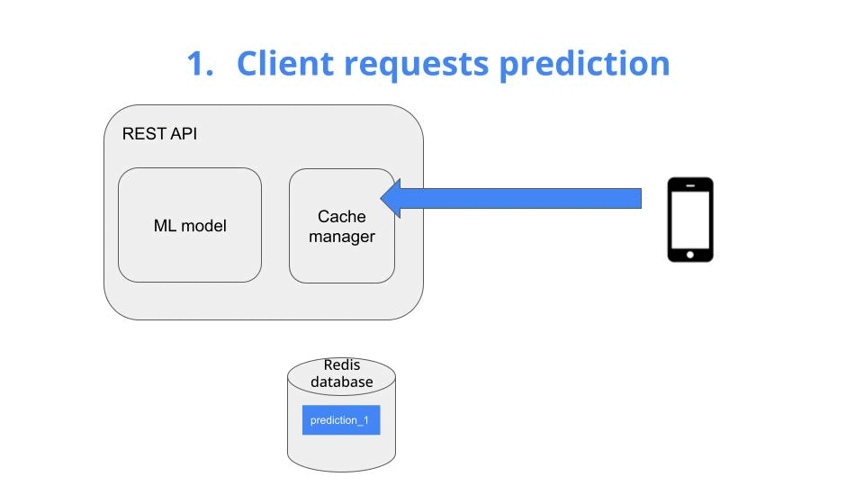
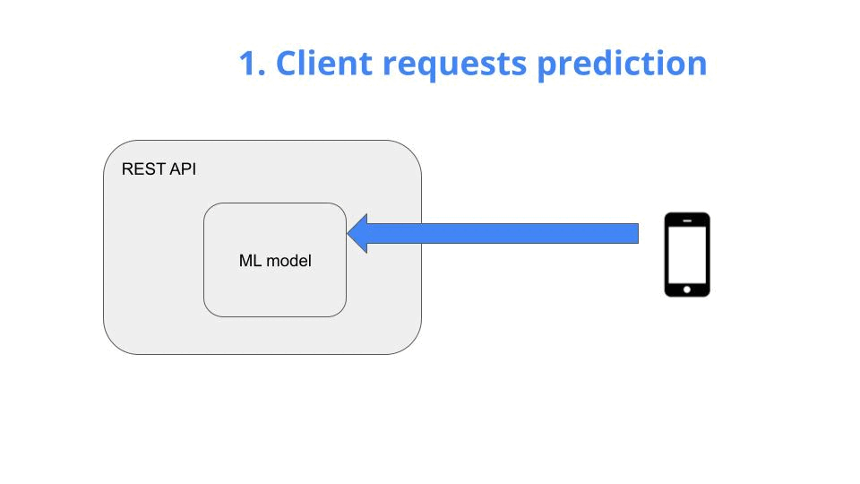
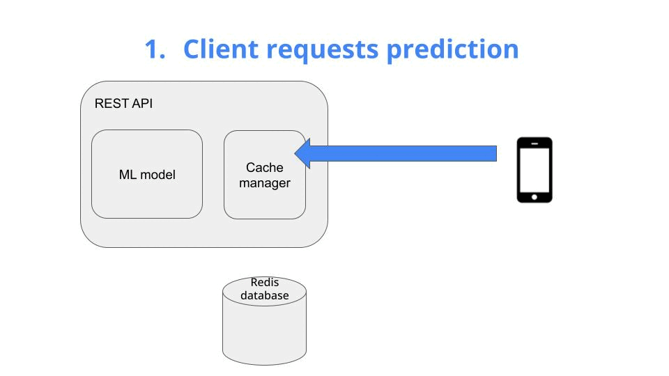

<div align="center">
    <h1>How to serve ML predictions 100x faster</h1>
    
</div>

#### Table of contents
* [The problem](#the-problem)
* [Solution](#solution)
* [Run the whole thing in 5 minutes](#run-the-whole-thing-in-5-minutes)
* [Wanna learn more real-world ML?](#wanna-learn-more-real-world-ml)


## The problem

A very common way to deploy an ML model, and make its predictions accessible to other services, is by using a REST API.

It works as follows:
1. The client requests a prediction -> *Give me the price of ETH/EUR in the next 5 minutes*
2. The ML model generates the prediction,
3. The prediction is sent back to the client -> *predicted price = 2,300 USD*

<div align="center">
    <h3>REST API from your textbook 🐢</h3>
    
</div>

This design works, but it can become terribly unefficient in many real-world scenarios.

*Why?*

Because more often than not, your ML model will re-compute the exact same prediction it already computed for a previous request.

So you will be doing the same (costly) work more than once.

This become a serious bottleneck if the request volume grows, and you model is large, like a Large Language Model.

So the question is:

> Is there a way to avoid re-computing costly predictions? 🤔

And the answer is … YES!

## Solution

Caching is a standard technique to speed up API response time.

The idea is very simple. You add a fast key-value pair database to your system, for example Redis, and use it to store past predictions.

When the first request hits the API, your cache is still empty, so you
* generate a new prediction with your ML model
* store it in the cache, as a key-value pair, and
* return it to the client

<div align="center">
    <h3>REST API with a fast in-memory cache ⚡</h3>
    
</div>

Now, when the second request arrives, you can simply
* load it from the cache (which is super fast), and
* return it to the client

<div align="center">
    <h3>REST API with a fast in-memory cache ⚡</h3>
    
</div>

<br>

To ensure the predictions stored in your cache are still relevant, you can set an expiry date. Whenever a prediction in the cache gets too old, it is replaced by a newly generate prediction.

> **For example**
> 
> If your underlying ML model is generating price predictions 5 minutes into the future, you can tolerate predictions that are up to, for example, 1-2 minutes old.


## Run the whole thing in 5 minutes

1. Install all project dependencies inside an isolated virtual env, using Python Poetry
    ```
    $ make install
    ```

2. Run the REST API without cache
    ```
    $ make api-without-cache
    ```

3. Open another terminal and run
    ```
    $ make requests
    ```
    to send 100 requests and check the response time
    ```
    Time taken: 1014.67ms
    Time taken: 1027.10ms
    Time taken: 1013.05ms
    Time taken: 1011.15ms
    Time taken: 1004.31ms
    ...
    ```

4. Stop the api and re-start it, this time enabling the cache
    ```
    $ make api-with-cache
    ```
    and resend the 100 requests. The response time for the first request is still high, but 100x faster for the the following requests.


## Wanna learn more real-world ML?

Join more than 18k builders to the **Real-World ML Newsletter**.

Every Saturday morning.

For **FREE**

### [👉🏽 Subscribe for FREE](https://www.realworldml.net/subscribe)
